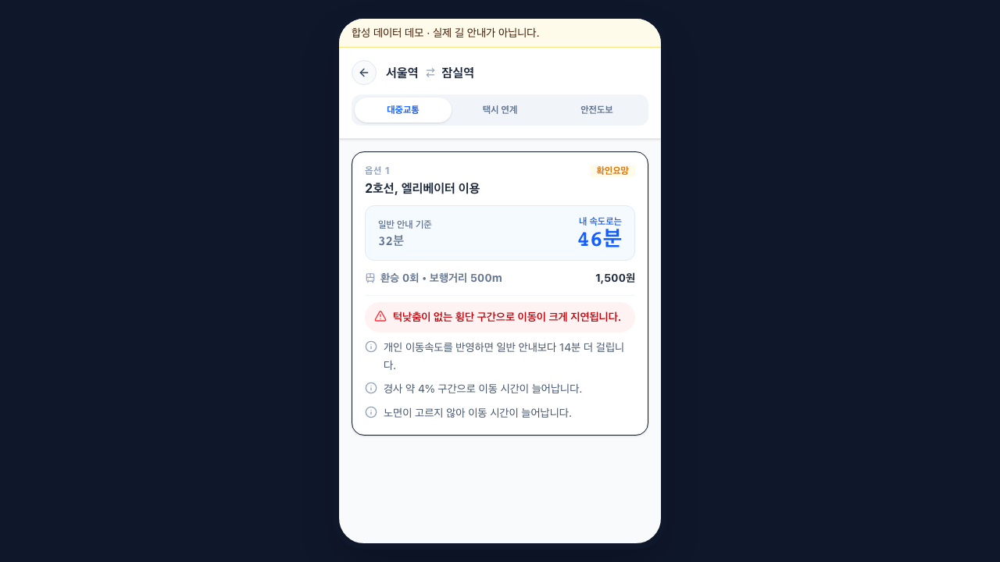
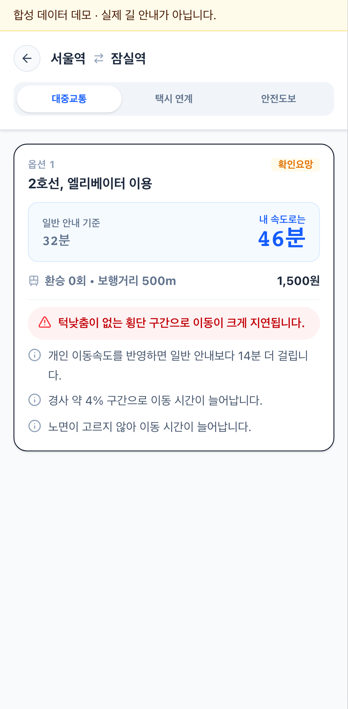
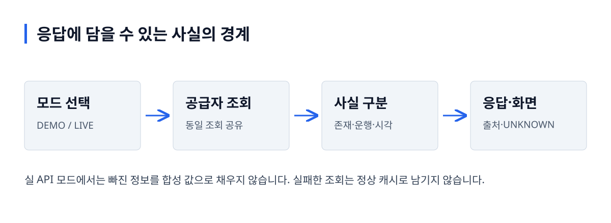

# My ETA

**외부 정보가 없을 때, 확인하지 못한 사실을 확인됐다고 말하지 않습니다.**

Tech4Good 2026 팀 프로젝트의 Python·FastAPI·React 코드입니다. 이번 개인 보강은 데이터 출처·시설 존재와 운행 상태·외부 호출의 동시 요청 처리를 다룹니다. 기존 언어와 공급자 구조를 유지합니다.

[핵심 판단](#핵심-판단) · [검증 결과](#검증-결과) · [로컬 실행](#로컬-실행) · [코드 읽기](#코드-읽기)

## 실제 화면



실제 로컬 FastAPI 데모 응답을 사용한 화면입니다. 장소 SDK만 테스트 대역으로 바꿨고 경로·소요 시간은 합성 값입니다. 실제 길 안내나 지도 정확도 검증 화면이 아닙니다.

<details>
<summary>모바일 화면</summary>



</details>

## 사용 흐름과 처리 구조

데모 로그인 → 출발·도착지 선택 → 경로 요청 → 합성 출처·확인 필요 정보 확인



그림 설명: 모드 선택 → 공급자 조회 → 사실 구분 → 응답·화면. 실 API 모드에서는 빠진 정보를 합성 값으로 채우지 않습니다. 실패한 조회는 정상 캐시로 남기지 않습니다.

## 핵심 판단

| 문제 | 선택 | 확인한 근거 |
|---|---|---|
| 실 API 모드에도 모의 보행·버스 정보가 섞일 수 있었습니다. | 공급자를 모드별로 분리하고 확인 못한 값은 `UNKNOWN`으로 처리합니다. | [공급자 구성](backend/app/main.py), [경계 회귀](backend/tests/test_rebuild_boundaries.py) |
| 시설 목록의 존재가 현재 운행 가능으로 해석됐습니다. | `exists`, `status`, `fetchedAt`, `observedAt`의 의미를 구분합니다. | [서울 공급자](backend/app/providers/seoul.py), [화면 매핑](frontend/src/api/mappers.ts) |
| 빈 캐시의 동시 요청이 원본을 중복 조회했습니다. | 진행 중인 작업을 공유하고 실패·취소·TTL 경계를 검증합니다. | [요청 공유 회귀](backend/tests/test_rebuild_boundaries.py), [원표본](docs/evidence/2026-10-02/source-cache.json) |

## 검증 결과

2026-10-02 로컬 검증: Python **83개**, 프론트 단위 **24개**, 데스크톱·모바일 **E2E 2개 통과**. HTTP 전송을 대체한 실제 클라이언트에서 빈 캐시 동시 8개 요청은 원본 조회 1번, 채워진 뒤 추가 8개 요청은 원본 추가 0번을 관측했습니다.

이는 한 프로세스의 요청 수 관측입니다. 실제 서울 API의 응답시간이나 길찾기 정확도 개선을 뜻하지 않습니다. E2E는 실제 로컬 경로 API를 호출하며 외부 장소 SDK만 대체했습니다.

[검증 기록](docs/VERIFICATION.md) · [테스트 결과](docs/evidence/2026-10-02/tests.xml) · [과거 고정 지연 함수 실험](docs/PERF_RESULT.md)

## 로컬 실행

```bash
# API 데모: 외부 키 없이 실행
docker compose -p eta-rebuild -f compose.demo.yml up -d --build
curl http://localhost:18083/health
```

API 문서는 `http://localhost:18083/docs`입니다. 기본 모드는 `DEMO`입니다.

```bash
cd frontend
npm ci
VITE_API_BASE_URL=http://localhost:18083/api/v1 npm run dev
```

화면의 기존 데모 계정은 `test@eta.com / password123`입니다. 지도·장소 검색에는 Kakao JavaScript 키가 필요합니다. 키 없이 API 문서로 경로 응답을 확인할 수 있습니다.

```bash
uv sync --project backend --locked --all-groups
uv run --project backend pytest backend/tests
uv run --project backend ruff check backend/app backend/tests backend/tools/measure_source_cache.py
npm test --prefix frontend
npm run lint --prefix frontend
npm run build --prefix frontend
# 실행 중인 API를 stop한 뒤: 같은 포트를 E2E가 사용합니다.
(cd frontend && npx playwright test)
```

## 범위와 한계

실제 TMAP·서울 API 호출, 지도·장소 검색 품질, 현장 접근성·운행 상태·길찾기 정확도는 미검증입니다. 캐시 요청 공유는 한 프로세스 범위이며 여러 worker의 공유 캐시가 아닙니다. 기존 데모 인증은 실제 사용자 인증 서비스가 아닙니다.

이번 개인 보강은 AI 지원으로 구현하고 로컬에서 검증했습니다. 코드로 확인한 동작·실험 관측·미검증 범위를 구분하며, 실제로 겪지 않은 운영 장애나 팀 전체 결과를 개인 성과로 표현하지 않습니다.

## 코드 읽기

[공급자 구성](backend/app/main.py) → [SeoulDataClient](backend/app/providers/seoul.py) → [응답 모델](backend/app/models.py) → [프론트 매핑](frontend/src/api/mappers.ts). [선택 이유·실패 조건·변경 과제](docs/SERVICE_GUIDE.md)와 함께 읽습니다.

[기존 팀 README](docs/archive/README-team-before-rebuild.md) · [OpenAPI 계약](docs/openapi.yaml)
